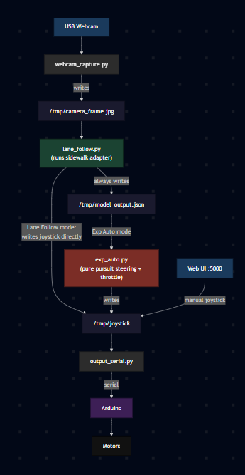
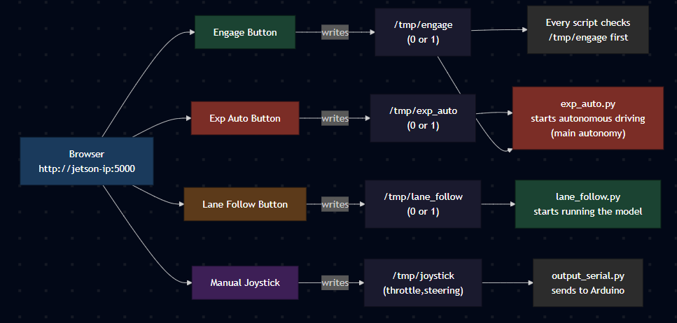
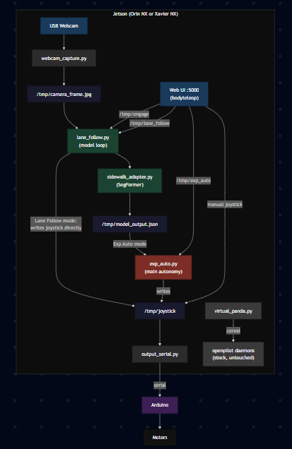

# MicroPilot

**By Abdullah Hanoosh**

An adapted fork of [comma.ai openpilot](https://github.com/commaai/openpilot)
rebuilt to drive two custom vehicles autonomously.

- **[`scooter/`](./scooter/README.md)**: electric scooter on a Jetson Orin NX
- **[`gokart/`](./gokart/README.md)**: electric go-kart on a Jetson Xavier NX

Both vehicles run the same stack and both startup scripts are built around a
SegFormer semantic segmentation model that detects sidewalks. The experimental
autopilot `tools/exp_auto.py` is the main autonomy loop: it reads the sidewalk
mask, lane-keeps on the detected path, and holds a constant throttle while a
sidewalk is in view. Openpilot's supercombo road model is still in the scooter
tree as a secondary adapter but is not used in the default launch.

Each folder has its own README explaining the version and how it differs.

## Docs

- [`docs/MODELS_AND_ADAPTERS.md`](./docs/MODELS_AND_ADAPTERS.md): adapter pattern and how to swap or add a model
- [`docs/IPC.md`](./docs/IPC.md): every `/tmp/` file with its writer, reader, and format

### Per-file documentation

Every custom file has a detailed MD doc next to it explaining every function,
constant, IPC file, and how to modify it. The same layout exists in both
`scooter/tools/` and `gokart/tools/`.

**Core pipeline:**

| Doc | Describes |
|---|---|
| [`tools/LANE_FOLLOW.md`](./scooter/tools/LANE_FOLLOW.md) | Main model loop. Reads camera, runs adapter, writes model output and joystick. |
| [`tools/EXP_AUTO.md`](./scooter/tools/EXP_AUTO.md) | Main autonomy loop. Pure pursuit steering, curvature braking, dual lookahead. |
| [`tools/OUTPUT_SERIAL.md`](./scooter/tools/OUTPUT_SERIAL.md) | Arduino serial bridge. Scooter sends 3 values, go-kart sends 6. |

**Model adapters:**

| Doc | Describes |
|---|---|
| [`tools/adapters/BASE_ADAPTER.md`](./scooter/tools/adapters/BASE_ADAPTER.md) | Abstract interface and return format contract. |
| [`tools/adapters/SIDEWALK_ADAPTER.md`](./scooter/tools/adapters/SIDEWALK_ADAPTER.md) | SegFormer segmentation, edge scanning, centerline steering. |
| [`tools/adapters/SUPERCOMBO_ADAPTER.md`](./scooter/tools/adapters/SUPERCOMBO_ADAPTER.md) | Openpilot road model, YUV preprocessing, lane/path parsing. |

**Support tools:**

| Doc | Describes |
|---|---|
| [`tools/WEBCAM_CAPTURE.md`](./scooter/tools/WEBCAM_CAPTURE.md) | USB webcam capture to /tmp/camera_frame.jpg. |
| [`tools/VIRTUAL_PANDA.md`](./scooter/tools/VIRTUAL_PANDA.md) | Fake comma body panda over cereal. |
| [`tools/OVERLAY_STREAM.md`](./scooter/tools/OVERLAY_STREAM.md) | Lane lines and path drawn on camera feed for web UI. |
| [`tools/AUTOPILOT.md`](./scooter/tools/AUTOPILOT.md) | Simple constant-throttle autopilot for testing. |
| [`tools/VIDEO_FEED.md`](./scooter/tools/VIDEO_FEED.md) | Plays video file into /tmp/camera_frame.jpg for testing. |
| [`tools/CAMERA_BRIDGE.md`](./scooter/tools/CAMERA_BRIDGE.md) | ESP32-CAM WiFi MJPEG bridge (scooter only). |
| [`tools/LANE_VIZ.md`](./scooter/tools/LANE_VIZ.md) | Offline supercombo visualization on video files. |
| [`tools/bodyteleop/WEB.md`](./scooter/tools/bodyteleop/WEB.md) | Web UI on port 5000. Endpoints, toggles, joystick. |
| [`tools/ACTUATOR_LOGGER.md`](./scooter/tools/ACTUATOR_LOGGER.md) | Logs cereal carOutput to CSV. |
| [`tools/DIAGNOSE_MSG.md`](./scooter/tools/DIAGNOSE_MSG.md) | Checks if cereal messages are alive. |
| [`tools/AUTO_SOURCE.md`](./scooter/tools/AUTO_SOURCE.md) | Prints log identifiers from openpilot logs. |
| [`tools/SETUP_SIDEWALK_MODEL.md`](./gokart/tools/SETUP_SIDEWALK_MODEL.md) | Downloads SegFormer and builds TRT engine (go-kart only). |

---

## Architecture

Both versions follow the same flow. A Jetson runs a neural network on camera
frames, writes steering and throttle commands to a file under `/tmp/`, and a
small serial script relays those commands to an Arduino which drives the motors.

### End-to-end data flow



`lane_follow.py` and `exp_auto.py` are two separate processes running in two
separate tmux sessions. `lane_follow.py` always runs the model and writes
`/tmp/model_output.json`. What happens next depends on which mode is active:

- **Lane Follow mode** (`/tmp/lane_follow` is 1): `lane_follow.py` writes
  `/tmp/joystick` directly based on the model steering output.
- **Exp Auto mode** (`/tmp/exp_auto` is 1): `lane_follow.py` only writes
  `model_output.json`. `exp_auto.py` reads that JSON, applies pure pursuit
  steering, adjusts throttle based on confidence and curvature, and writes
  `/tmp/joystick`.
- **Manual mode** (both off): the web UI joystick writes `/tmp/joystick`
  directly from the browser.

In all cases, `output_serial.py` picks up `/tmp/joystick` and sends the CSV
to the Arduino.

### Messaging

Cereal/msgq, openpilot's native messaging bus, is left in place for the upstream
daemons. The new custom scripts under `tools/` add a file-based IPC layer in
`/tmp/` on top of cereal, not as a replacement.

### Comma body trick

Openpilot is configured to think it is a comma body robot, not a car. This is
done by `tools/virtual_panda.py`, which fakes the cereal messages a real comma
3X panda would publish using `brand=body`, `carFingerprint=COMMA BODY`, and
safety model `body`. The body profile lets openpilot accept joystick steering
and throttle commands directly, which is what makes the rest of the pipeline
possible without a real car.

### Web UI control flow



Every loop in `tools/` checks `/tmp/engage` before doing anything.
`lane_follow.py` starts running the model when `/tmp/lane_follow` is 1.
`exp_auto.py` starts autonomous driving when `/tmp/exp_auto` is 1 and engage
is on. `exp_auto.py` is the main autonomy loop that actually moves the vehicle.

### System overview



---

## What was built

1. **Virtual panda layer.** `tools/virtual_panda.py` impersonates the comma body
   panda over cereal so openpilot daemons run with no real panda hardware.
2. **File-based IPC on top of cereal.** New scripts under `tools/` talk through
   atomic text files in `/tmp/` (`/tmp/joystick`, `/tmp/engage`,
   `/tmp/model_output.json`, etc). Cereal is untouched.
3. **Adapter layer for the model.** `tools/adapters/` defines a base class that
   any model implements. The active adapter on both vehicles is
   `sidewalk_adapter.py`, which runs SegFormer on camera frames and returns a
   steering value from the detected sidewalk centerline. The scooter also ships
   `supercombo_adapter.py` as an optional road-lane adapter that is not in the
   default launch path.
4. **Experimental autopilot.** `tools/exp_auto.py` is the main autonomy loop.
   It reads the model output, holds a constant throttle while a sidewalk is
   detected, and lane-keeps on the sidewalk centerline before writing the final
   joystick command.
5. **Arduino bridge.** `tools/output_serial.py` reads `/tmp/joystick` and sends
   a CSV line to the Arduino. The scooter uses 3 values: `throttle, steering,
   lidar_flag`. The go-kart uses 6 values: `steer, brake, arm, throttle,
   direction, speed_setting`.
6. **Web UI.** Openpilot's body teleop web UI runs on port 5000 and exposes the
   engage button, lane-follow toggle, and live camera feed.
7. **Tmux launcher.** `tools/launch_all.sh` starts every component in its own
   tmux session in the right order.

---

## Hardware

### Scooter (Jetson Orin NX)
- Jetson Orin NX dev kit
- USB webcam, 640x480 @ 20fps
- Arduino on `/dev/ttyACM0` or `/dev/ttyACM1`

### Go-kart (Jetson Xavier NX)
- Jetson Xavier NX
- USB webcam
- Arduino flashed with the 6 value firmware

---

## Setup

1. Flash JetPack 5.x for the target Jetson.
2. Clone the repo:
   ```bash
   git clone <github-url> ~/openpilotV3
   cd ~/openpilotV3
   ```
3. Install Python deps:
   ```bash
   pip3 install -r requirements.txt
   pip3 install opencv-python numpy onnxruntime-gpu pyserial flask
   ```
4. Rebuild the SegFormer TRT engine on the target board (engines are
   GPU-arch locked and cannot be shared between Jetsons):
   - Scooter:
     ```bash
     cd selfdrive/modeld/models
     /usr/src/tensorrt/bin/trtexec --onnx=sidewalk_segmentation.onnx --saveEngine=sidewalk_segmentation.engine --fp16
     ```
   - Go-kart:
     ```bash
     python3 tools/setup_sidewalk_model.py
     ```
5. Plug in the Arduino and webcam. Confirm ports with
   `ls /dev/ttyACM* /dev/ttyUSB*`.
6. Flash the matching Arduino sketch (scooter: 3 value firmware, go-kart: 6
   value firmware). The sketches are not tracked in this repo.

---

## Run

### Scooter
```bash
cd ~/openpilotV3
bash tools/launch_all.sh --serial /dev/ttyACM0
```

### Go-kart
```bash
cd ~/openpilotV3_gokart
bash tools/launch_all.sh --serial /dev/ttyACM0
```

Common flags: `--serial /dev/ttyACM0`, `--no-model`, `--speed 0.45`.
The launch script also accepts `--no-lidar` and `--lidar-port` for the lidar
safety layer which will be documented later.

Both launchers spawn tmux sessions for: webcam, virtual panda, joystick, body
teleop, serial, lane follow, overlay, exp auto, autopilot.

Open the web UI at **http://\<jetson-ip\>:5000**. Engage arms the system, Lane
Follow starts the model, and Exp Auto starts autonomous driving. To kill
everything: `tmux kill-server`.

---

## Custom code map

Every file in this table was written or heavily modified for this project. The
same layout exists in both `scooter/tools/` and `gokart/tools/`, so a path like
`tools/lane_follow.py` refers to both copies unless noted.

| File | What it does |
|---|---|
| `start_scooter.sh`, `start_kart.sh` | Top level launch script. Calls `tools/launch_all.sh` with default flags. |
| `tools/launch_all.sh` | Tmux launcher. Starts one tmux session per component in the right order. |
| `tools/lane_follow.py` | Main model loop. Reads camera frame, runs the active adapter, writes `/tmp/model_output.json` and `/tmp/joystick`. |
| `tools/exp_auto.py` | Main autonomy loop used by the default launch. Holds constant throttle when a sidewalk is detected and lane-keeps on the sidewalk centerline. |
| `tools/autopilot.py` | Simpler autopilot used for standalone throttle testing. Constant throttle when on. |
| `tools/adapters/base_adapter.py` | Abstract interface every model adapter implements. Defines `load_model()` and `run(frame)`. |
| `tools/adapters/sidewalk_adapter.py` | Active adapter on both vehicles. Runs SegFormer on RGB frames, finds the sidewalk centerline, returns a steering value. |
| `tools/adapters/supercombo_adapter.py` | Optional road-lane adapter. Runs openpilot's supercombo on YUV frames. Present in both trees but not in the default launch path. |
| `tools/webcam_capture.py` | Grabs frames from the USB webcam and writes them to `/tmp/camera_frame.jpg` at around 20 Hz. |
| `tools/camera_bridge.py` (scooter only) | Alternative camera source that pulls an MJPEG stream from an ESP32 cam over WiFi. |
| `tools/video_feed.py` | Plays a video file into `/tmp/camera_frame.jpg` for testing without a real camera. |
| `tools/output_serial.py` | Reads `/tmp/joystick` and sends the CSV line to the Arduino over serial. Scooter sends 3 values, go-kart sends 6. |
| `tools/virtual_panda.py` | Impersonates the comma body panda over cereal using `brand=body`, `carFingerprint=COMMA BODY`, safety model `body`. This is what lets openpilot run with no real car or panda. |
| `tools/overlay_stream.py` | Draws lane lines, sidewalk mask, and the planned path on top of the camera feed for the web UI. |
| `tools/lane_viz.py` | Offline visualization helper. Runs the active adapter on a video file and renders the overlay. |
| `tools/bodyteleop/web.py` | Openpilot body teleop web UI on port 5000. Hosts the Engage and Lane Follow buttons. Writes `/tmp/engage` and `/tmp/lane_follow`. |
| `tools/actuator_logger.py` | Logs every joystick command to a CSV file for later analysis. Uses cereal. |
| `tools/diagnose_msg.py` | Prints openpilot cereal messages live for debugging. |
| `tools/auto_source.py` | Prints log identifiers from an openpilot log file. |
| `tools/setup_sidewalk_model.py` (gokart only) | Downloads SegFormer-B3 ONNX and builds the TRT engine on the Xavier. |

For the full per-vehicle file inventory with Jetson paths see
[`scooter/README.md`](./scooter/README.md) and [`gokart/README.md`](./gokart/README.md).

### Stock openpilot files worth knowing

These are not custom, they come from upstream openpilot, but they matter for
understanding how the fork fits together. Everything else under `selfdrive/`,
`system/`, `cereal/`, and `panda/` is stock and not listed here.

| File | What it does |
|---|---|
| `selfdrive/manager/manager.py` | Top level openpilot process supervisor. Starts and watches every stock daemon. Launched by the tmux session. |
| `selfdrive/manager/process_config.py` | List of every openpilot process the manager spawns. |
| `selfdrive/controls/controlsd.py` | Openpilot's main control daemon. With the body profile it accepts joystick steering and throttle directly. |
| `selfdrive/car/body/` | Comma body robot car port. The fork impersonates this so `controlsd` runs with no real vehicle. |
| `selfdrive/modeld/modeld.py` | Stock openpilot vision model runner. Not used by the custom `lane_follow.py` loop but still started by the manager. |
| `selfdrive/modeld/models/supercombo.onnx` | Stock openpilot driving model. Only used by `supercombo_adapter.py`, which is not in the default launch. |
| `cereal/messaging/` | Openpilot's pub/sub messaging library. Used by `virtual_panda.py`, `actuator_logger.py`, and `diagnose_msg.py`. Left intact. |
| `cereal/log.capnp`, `cereal/car.capnp` | Cereal message schemas. The `CarParams` and `PandaState` shapes used by the virtual panda are defined here. |
| `panda/` | Openpilot's panda firmware and Python library. Not flashed to any real panda, but imported by some cereal consumers. |
| `system/hardware/` | Hardware abstraction layer. Detects the Jetson and picks the right camera and GPIO paths. |
| `tools/bodyteleop/` | Stock body teleop web UI. The fork uses its `web.py` as the engage and lane-follow control panel. |
| `tools/joystick/joystickd.py` | Stock joystick daemon. Bridges joystick commands into cereal so `controlsd` sees them as user input. |

## Adding a new model

1. Drop the `.onnx` (and optionally a prebuilt `.engine`) into `selfdrive/modeld/models/`.
2. Copy `sidewalk_adapter.py` to `adapters/myname_adapter.py` and edit the
   preprocessing, inference, and postprocessing.
3. Add an `elif` branch in `create_adapter()` inside `lane_follow.py` and add
   `"myname"` to the argparse `choices=[...]` list.
4. Run: `python3 tools/lane_follow.py --model myname`.

Detailed walk-through: [`docs/MODELS_AND_ADAPTERS.md`](./docs/MODELS_AND_ADAPTERS.md).

## IPC files

| File | Writer | Reader | Meaning |
|---|---|---|---|
| `/tmp/camera_frame.jpg` | `tools/webcam_capture.py` | `tools/lane_follow.py` | latest frame |
| `/tmp/model_output.json` | `tools/lane_follow.py` | `tools/overlay_stream.py`, `tools/exp_auto.py` | model results |
| `/tmp/joystick` | `tools/lane_follow.py`, `tools/exp_auto.py`, web UI | `tools/output_serial.py` | `throttle,steering` |
| `/tmp/engage` | `tools/bodyteleop/web.py` | every loop in `tools/` | `0` or `1` |
| `/tmp/lane_follow` | `tools/bodyteleop/web.py` | `tools/lane_follow.py` | `0` or `1` |
| `/tmp/exp_auto` | `tools/bodyteleop/web.py` | `tools/exp_auto.py` | `0` or `1` |

Full schemas and the joystick CSV format are in [`docs/IPC.md`](./docs/IPC.md).

---


## Repo layout

```
OpenPilot_Ab/
  README.md
  docs/
    MODELS_AND_ADAPTERS.md
    IPC.md
  scooter/
    tools/        custom scooter code
    selfdrive/    stock openpilot
  gokart/
    tools/        custom go-kart code
    selfdrive/    stock openpilot
```
