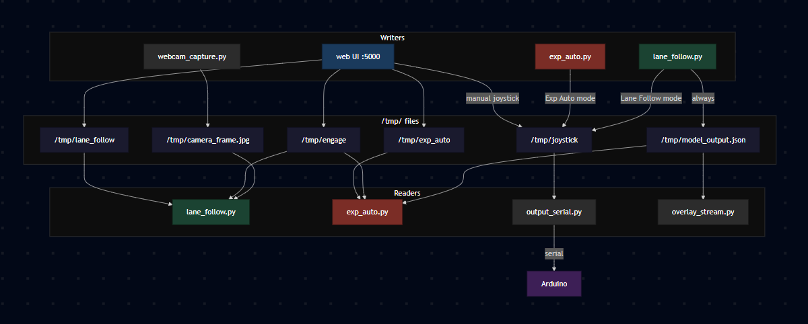

# IPC

The custom scripts use plain text files in `/tmp/` as a message bus on top of
openpilot's cereal/msgq. Cereal is left intact for the upstream daemons. The
file-based layer was added so the new scripts under `tools/` can talk to each
other in any language with one line of code.

Every writer uses an atomic `open(tmp); write(); rename(tmp, real)` so readers
never see a half-written file.

> Linked from [`../README.md`](../README.md), [`../scooter/README.md`](../scooter/README.md), [`../gokart/README.md`](../gokart/README.md).

---

## How the files connect



Each box is a separate tmux session. The `/tmp/` files are how they talk to
each other. Every writer uses atomic rename so readers never see partial data.

---

## Why files alongside cereal

- Cross-language. Bash, Python, the web UI, and the model loop all read and
  write the same files with one line of code.
- Easy to debug. `cat /tmp/joystick`, `cat /tmp/lidar_stop`, done.
- Adding a new field does not require recompiling cereal/msgq schemas.
- The atomic write/rename pattern means readers never observe a torn write.

---

## File table

| File | Format | Writer | Readers | Meaning |
|---|---|---|---|---|
| `/tmp/camera_frame.jpg` | JPEG | `tools/webcam_capture.py` | `tools/lane_follow.py`, `tools/overlay_stream.py` | Latest camera frame, written at ~20 Hz |
| `/tmp/model_output.json` | JSON | `tools/lane_follow.py` | `tools/overlay_stream.py`, `tools/exp_auto.py`, `tools/autopilot.py` | Model results: steering, confidence, lane lines, plan positions |
| `/tmp/joystick` | `throttle,steering` (CSV, 2 floats) | `tools/lane_follow.py`, web UI | `tools/output_serial.py` | Final command sent to the Arduino |
| `/tmp/joystick.tmp` | same | atomic temp | renamed to `/tmp/joystick` | |
| `/tmp/engage` | `0` or `1` | `tools/bodyteleop/web.py` | every loop in `tools/` | Global engage button |
| `/tmp/lane_follow` | `0` or `1` | `tools/bodyteleop/web.py` | `tools/lane_follow.py` | Lane-follow toggle |
| `/tmp/exp_auto` | `0` or `1` | `tools/bodyteleop/web.py` | `tools/exp_auto.py`, `tools/lane_follow.py` | Experimental auto mode toggle |
| `/tmp/lidar_stop` | `0` or `1` | `tools/lidar_safety.py` | `tools/lane_follow.py`, `tools/output_serial.py` | Emergency stop from the lidar |
| `/tmp/lidar_steer` | float | `tools/lidar_safety.py` | `tools/autopilot.py` | Obstacle-avoidance steering hint |
| `/tmp/autopilot` | `0` or `1` | `tools/bodyteleop/web.py` | `tools/autopilot.py` | Autopilot toggle |

All paths above are relative to either:
- `scooter/` (on the Jetson Orin: `~/openpilotV3/`)
- `gokart/`  (on the Jetson Xavier: `~/openpilotV3_gokart/`)

The two versions are identical at the IPC layer.

---

## model_output.json schema

Written by `tools/lane_follow.py`, function `write_model_output()` near line 110:

```json
{
  "steering":        -0.123,
  "confidence":       0.78,
  "lane_lines":      [ {"y":[33 floats], "z":[33 floats], "prob": 0.9}, ... 4 lines ],
  "plan_positions":  [[x,y,z], ... 33 points],
  "plan_prob":        0.85,
  "left_near_y":      1.20,
  "right_near_y":    -1.10,
  "left_near_prob":   0.91,
  "right_near_prob":  0.88,
  "frame":            12345,
  "ts":               1712345678.123
}
```

If this shape changes, these consumers must be updated together:

- `scooter/tools/overlay_stream.py` and `gokart/tools/overlay_stream.py`
- `scooter/tools/exp_auto.py` and `gokart/tools/exp_auto.py`
- `scooter/tools/autopilot.py` and `gokart/tools/autopilot.py`

See [`MODELS_AND_ADAPTERS.md`](./MODELS_AND_ADAPTERS.md) for the full adapter
contract.

---

## joystick format

Two floats, comma-separated, no whitespace, no trailing newline:

```
0.4500,-0.1234
```

- First value: throttle, range `-1.0 .. +1.0`. Negative is reverse
- Second value: steering, range `-1.0 .. +1.0`. Negative turns left.

The reader is `tools/output_serial.py`. The scooter converts the two floats
into a 3 value CSV (`throttle,steering,lidar_flag`). The go-kart converts them
into a 6 value CSV (`steer,brake,arm,throttle,direction,speed_setting`).

---

## Live debugging

From the Jetson:
```bash
watch -n 0.2 'cat /tmp/joystick; echo; cat /tmp/lidar_stop; echo; cat /tmp/engage'
```

Or tail the JSON:
```bash
watch -n 0.5 'cat /tmp/model_output.json | python3 -m json.tool | head -30'
```

If a value is stuck, the writer's tmux session most likely died. Reattach with:
```bash
tmux ls
tmux attach -t lanefollow
```

---

## See also

- [`../README.md`](../README.md)
- [`./MODELS_AND_ADAPTERS.md`](./MODELS_AND_ADAPTERS.md)
