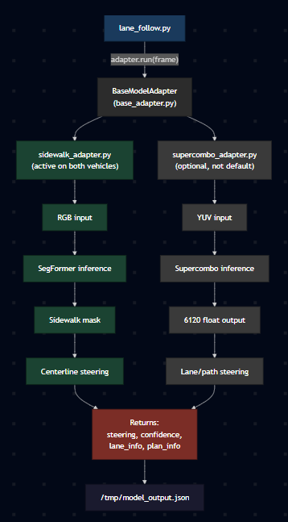

# Models and Adapters

How the model layer works in this fork and exactly which files to touch when
swapping or adding a new neural network. Applies to both the scooter and the
go-kart.

> Linked from [`../README.md`](../README.md), [`../scooter/README.md`](../scooter/README.md), [`../gokart/README.md`](../gokart/README.md).

---

## Architecture

`lane_follow.py` is model-agnostic. It never imports a model directly. It
imports an adapter that wraps a specific model and exposes a fixed interface.
Adding a new model means writing a new adapter and registering it in one place.

### How the adapter sits in the pipeline



---

## File map

### Scooter (`~/openpilotV3` on the Jetson, `scooter/` in this repo)

| Item | Path |
|---|---|
| Main loop | `scooter/tools/lane_follow.py` |
| Adapter base class | `scooter/tools/adapters/base_adapter.py` |
| Active adapter | `scooter/tools/adapters/sidewalk_adapter.py` |
| Supercombo adapter, present, not in default launch | `scooter/tools/adapters/supercombo_adapter.py` |
| Adapter package init | `scooter/tools/adapters/__init__.py` |
| Supercombo ONNX | `scooter/selfdrive/modeld/models/supercombo.onnx` |
| Supercombo TRT engine | `scooter/selfdrive/modeld/models/supercombo.engine` |
| Sidewalk ONNX, B0 backup | `scooter/selfdrive/modeld/models/sidewalk_segmentation.onnx` |
| Sidewalk TRT engine, B0 backup | `scooter/selfdrive/modeld/models/sidewalk_segmentation.engine` |
| Top level launcher | `scooter/start_scooter.sh` |
| Tmux launcher | `scooter/tools/launch_all.sh` |

### Go-kart (`~/openpilotV3_gokart` on the Jetson, `gokart/` in this repo)

| Item | Path |
|---|---|
| Main loop | `gokart/tools/lane_follow.py` |
| Adapter base class | `gokart/tools/adapters/base_adapter.py` |
| Active adapter | `gokart/tools/adapters/sidewalk_adapter.py` |
| Supercombo adapter, present, unused on go-kart | `gokart/tools/adapters/supercombo_adapter.py` |
| TRT engine setup helper | `gokart/tools/setup_sidewalk_model.py` |
| SegFormer-B0 ONNX | `gokart/selfdrive/modeld/models/sidewalk_segmentation.onnx` |
| SegFormer-B0 TRT engine | `gokart/selfdrive/modeld/models/sidewalk_segmentation.engine` |
| SegFormer-B3 ONNX/engine | not committed, regenerate via `setup_sidewalk_model.py` |
| Top level launcher | `gokart/start_kart.sh` |
| Tmux launcher | `gokart/tools/launch_all.sh` |

---

## Adapter contract

Every adapter inherits from `BaseModelAdapter` (defined in
`scooter/tools/adapters/base_adapter.py` and `gokart/tools/adapters/base_adapter.py`)
and must implement two methods:

```python
class MyAdapter(BaseModelAdapter):
    def load_model(self):
        """Called once at startup. Loads the .engine or .onnx into memory."""
        ...

    def run(self, bgr_frame):
        """Called every frame at ~20 Hz. Returns (steering, confidence, lane_info, plan_info)."""
        ...
```

### Required return shape from `run()`

```
steering    : float, -0.8 .. +0.8        negative right, positive left
confidence  : float,  0.0 .. 1.0

lane_info   : dict {
    "left_near_y"     : float, meters, positive left of center
    "right_near_y"    : float, meters, negative right of center
    "left_near_prob"  : float, 0..1
    "right_near_prob" : float, 0..1
    "_full"           : list of 4 lane line dicts, each {"y":[33], "z":[33], "prob":float}
}

plan_info   : dict {
    "positions" : list of 33 [x_forward, y_lateral, z_up] points
    "path_y"    : numpy array of 33 lateral offsets
    "prob"      : float, 0..1
}
```

Unused fields can be stubbed with zeros, but the shape must be correct.
Downstream code is defensive about missing values but not about missing keys.

---

## Adding a new model

The example below adds a model called `mynet`.

### 1. Drop the weights into the models folder

- Scooter: `scooter/selfdrive/modeld/models/mynet.onnx`
- Go-kart: `gokart/selfdrive/modeld/models/mynet.onnx`

To convert ONNX to a faster TRT engine, build it on the target Jetson because
engines are GPU-arch locked:

```bash
/usr/src/tensorrt/bin/trtexec --onnx=mynet.onnx --saveEngine=mynet.engine --fp16
```

### 2. Create the adapter file

```bash
cp scooter/tools/adapters/sidewalk_adapter.py scooter/tools/adapters/mynet_adapter.py
```

Inside `mynet_adapter.py` change:

- Class name to `class MyNetAdapter(BaseModelAdapter):`
- Top-of-file constants:
  - `SEG_ENGINE_PATH` to point at `mynet.engine`
  - `SEG_ONNX_PATH` to point at `mynet.onnx`
  - Input width and height (`INPUT_W`, `INPUT_H` or similar)
  - Number of output classes if the model is segmentation
- `load_model(self)` to load the new file and allocate input/output buffers
  matching the new shape and class count
- `run(self, bgr_frame)`:
  - Preprocessing: how `bgr_frame` is resized, color converted, and normalized.
    SegFormer uses RGB float32 with mean/std normalization. Supercombo uses YUV
    uint8. Match what the model was trained with.
  - Inference call stays the same (`self.context.execute_v2(...)`).
  - Postprocessing: how the raw output becomes a steering value. For
    segmentation models, the existing horizontal-slice scanner can usually be
    reused by changing which class index counts as "drivable".
  - The final return must match the contract above.

### 3. Register the adapter in lane_follow.py

Open `scooter/tools/lane_follow.py` (or `gokart/tools/lane_follow.py`) and find
`create_adapter()`, around line 173. Add an `elif`:

```python
elif model_name == "mynet":
    from adapters.mynet_adapter import MyNetAdapter
    return MyNetAdapter(steering_gain=steering_gain)
```

Then add `"mynet"` to the `--model` argparse `choices=[...]` list at the bottom
of the same file (in `main()`, around line 354).

### 4. Run

```bash
cd ~/openpilotV3            # or ~/openpilotV3_gokart
python3 tools/lane_follow.py --model mynet --speed 0.4
```

The log line `[lane_follow] Model: mynet` confirms the adapter loaded. Inspect
`/tmp/model_output.json` to confirm the output shape is correct.

### 5. Optional: make it the default in the launch script

To wire `start_scooter.sh` or `start_kart.sh` to use it automatically, edit:

- Scooter: `scooter/start_scooter.sh` or `scooter/tools/launch_all.sh`
- Go-kart: `gokart/start_kart.sh` or `gokart/tools/launch_all.sh`

Find the line that runs `lane_follow.py` and change `--model supercombo` or
`--model sidewalk` to `--model mynet`.

---

## Downstream consumers

These files read `/tmp/model_output.json`. If the JSON shape changes, they
break. Update them in lockstep with the adapter contract.

| File | What it reads |
|---|---|
| `scooter/tools/overlay_stream.py` and gokart copy | Lane overlays drawn on the camera feed for the web UI |
| `scooter/tools/exp_auto.py` and gokart copy | Experimental autopilot mode |
| `scooter/tools/autopilot.py` and gokart copy | Combines model output with `/tmp/lidar_steer` for the final command |
| `scooter/tools/lane_viz.py` and gokart copy | Standalone visualization helper |

The IPC file format is documented in [`IPC.md`](./IPC.md).

---

## Common mistakes

1. **Wrong color space.** Supercombo expects YUV. SegFormer expects RGB. The
   wrong format produces constant 0.5 outputs.
2. **Dividing by 255.** Supercombo wants raw uint8 cast to float16. SegFormer
   wants `(rgb / 255.0 - mean) / std`.
3. **Y-channel quadrant cropping.** For supercombo the Y channel must be
   subsampled, not cropped into quadrants. The correct order is in
   `supercombo_adapter.py`.
4. **Engine built on the wrong Jetson.** TRT engines are tied to the GPU arch.
   Build on the target board.
5. **Forgetting the argparse `choices` list.** Adding the `elif` to
   `create_adapter()` is not enough. Argparse rejects unknown `--model` values
   until the new name is also added to `choices=[...]` in `main()`.
6. **Wrong shape from `run()`.** If `lane_info["_full"]` is not a list of 4
   dicts each with `y`, `z`, `prob`, the overlay crashes. Stub with zeros if
   real lane lines are not available.

---

## See also

- [`../scooter/README.md`](../scooter/README.md)
- [`../gokart/README.md`](../gokart/README.md)
- [`./IPC.md`](./IPC.md)
