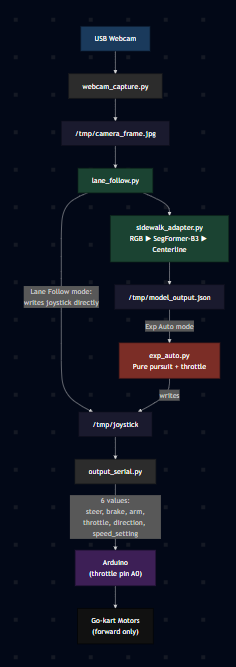

# Go-kart

The go-kart build of the openpilot fork. It runs on a Jetson Xavier NX
mounted on an electric go-kart and follows sidewalks using a SegFormer
semantic-segmentation model trained on Cityscapes.

The top-level [`../README.md`](../README.md) covers the overall architecture,
IPC layout, and shared setup. This file documents only what is specific to
the go-kart.

### Go-kart pipeline



---

## Differences from the scooter

| | Go-kart | Scooter |
|---|---|---|
| Compute | Jetson Xavier NX, Volta GPU | Jetson Orin NX, Ampere GPU |
| Active model | `segformer_b3_cityscapes.engine` (SegFormer-B3) | `sidewalk_segmentation.engine` (SegFormer-B0) |
| Backup model | `sidewalk_segmentation.engine` (SegFormer-B0, 29 MB) | `supercombo.engine`, not in default launch |
| Input color space | RGB, 512x512 | RGB for sidewalk, YUV for the unused supercombo path |
| Drives on | Sidewalks, Cityscapes class 1 | Sidewalks |
| Main autonomy loop | `tools/exp_auto.py` | `tools/exp_auto.py` |
| Steering source | Centerline of detected sidewalk pixels | Centerline of detected sidewalk pixels |
| Arduino protocol | 6 value CSV: `steer, brake, arm, throttle, direction, speed_setting` | 3 value CSV: `throttle, steering, lidar_flag` |
| Throttle pin | A0, analog input, not PWM | PWM |
| Reverse | Hardware-broken, forward only | Working |
| Launch script | `./start_kart.sh` | `./start_scooter.sh` |
| Default speed | `5` | `0.45` |
| Camera mount | ~0.5 m off the ground | Higher mount on the scooter pole |

The `tools/` layout, adapter system, web UI, virtual panda, and the file-based
IPC layer are identical to the scooter. Only the model, the preprocessing, and
the Arduino CSV format differ.

Cereal/msgq is left intact for openpilot's upstream daemons. The new custom
scripts under `tools/` add a file-based IPC layer in `/tmp/` on top of cereal,
not as a replacement.

Openpilot is configured to think it is a comma body robot, not a car. This is
done by `tools/virtual_panda.py`, which fakes the comma body panda over cereal
(`brand=body`, `carFingerprint=COMMA BODY`, safety model `body`).

---

## Setup

1. Flash JetPack 5.x onto the Xavier NX.
2. Clone this folder onto the Jetson as `~/openpilotV3_gokart`:
   ```bash
   git clone <repo-url> ~/openpilotV3_gokart
   ```
3. Install Python deps:
   ```bash
   pip3 install opencv-python numpy onnxruntime-gpu pyserial flask
   ```
4. Rebuild the SegFormer TRT engine. The B3 `.onnx` and `.engine` files are
   not committed because they exceed GitHub's 100 MB limit. Run:
   ```bash
   cd ~/openpilotV3_gokart
   python3 tools/setup_sidewalk_model.py
   ```
   This downloads `segformer_b3_cityscapes.onnx` and builds the engine for the
   Xavier's GPU. To use the lighter B0 backup instead, edit the script.
5. Flash the 6 value Arduino sketch with `THROTTLE_PIN = A0`. The sketch is
   not tracked in this repo.
6. Confirm hardware:
   ```bash
   ls /dev/ttyACM* /dev/ttyUSB*
   ```
7. Mount the camera at ~0.5 m off the ground. The sidewalk-detection bounds in
   `sidewalk_adapter.py` assume that geometry.

---

## Run

```bash
cd ~/openpilotV3_gokart
./start_kart.sh
```

Flags pass through to `tools/launch_all.sh`:
- `--serial /dev/ttyACM0`
- `--no-model` runs without the neural net
- `--speed 5`

The start script also contains a lidar safety block with its own flags
(`--no-lidar`, `--lidar-port`). Lidar is out of scope for this README and will
be documented later.

The launcher spawns the same set of tmux sessions as the scooter version.
Open the web UI at **http://\<jetson-ip\>:5000**, press Engage, then Lane
Follow, then Exp Auto to start autonomous driving. Kill switch:
`tmux kill-server`.

---

## Notes

- SegFormer is a segmentation model, not a path planner. It outputs a
  per-pixel class map. `tools/adapters/sidewalk_adapter.py` reads horizontal
  slices of that mask, finds the leftmost and rightmost sidewalk pixels in
  each slice, computes the centerline, and turns that into a steering
  command. If the camera mount changes, retune the slice ranges in that file.
- TRT engines are GPU-architecture-locked. A `.engine` built on the Orin
  (Ampere) will not run on this Xavier (Volta). Always rebuild on the
  go-kart's own board.
- The throttle pin is A0, not a real PWM. Fine speed control is broken in
  hardware. The `--speed` flag only has a few useful steps.
- Hardware reverse does not work. Forward only.
- If the Arduino hangs, increase the `write_timeout` in
  `tools/output_serial.py` from `0.5` to `2.0` and restart the serial tmux
  session.

---

## Custom code paths

All custom code lives under `gokart/tools/`. On the Jetson the same tree is
at `~/openpilotV3_gokart/tools/`.

| File | Purpose |
|---|---|
| `gokart/tools/lane_follow.py` | Main loop. Reads camera, runs the model adapter, writes joystick. |
| `gokart/tools/adapters/base_adapter.py` | Abstract interface every adapter implements. |
| `gokart/tools/adapters/sidewalk_adapter.py` | Active go-kart adapter. RGB prep, SegFormer mask, steering. |
| `gokart/tools/adapters/supercombo_adapter.py` | Supercombo adapter, present but not active on the go-kart. |
| `gokart/tools/setup_sidewalk_model.py` | Downloads SegFormer ONNX and rebuilds the TRT engine. |
| `gokart/tools/output_serial.py` | Reads `/tmp/joystick`, sends 6 value CSV (`steer,brake,arm,throttle,direction,speed_setting`) to the Arduino. |
| `gokart/tools/virtual_panda.py` | Impersonates the comma body panda over cereal so openpilot daemons run with no real panda. |
| `gokart/tools/webcam_capture.py` | Writes `/tmp/camera_frame.jpg` from the USB webcam. |
| `gokart/tools/exp_auto.py` | Experimental autopilot. Constant throttle when sidewalk is detected and model lane keeping. |
| `gokart/tools/autopilot.py` | Constant throttle when on, used for standalone throttle testing. |
| `gokart/tools/overlay_stream.py` | Draws lane lines and planned path on top of the camera feed for the web UI. |
| `gokart/tools/lane_viz.py` | Offline visualization that runs the model on a video file. |
| `gokart/tools/auto_source.py` | Prints log identifiers from an openpilot log file. |
| `gokart/tools/actuator_logger.py` | Logs every joystick command to a CSV file. Uses cereal. |
| `gokart/tools/diagnose_msg.py` | Prints openpilot cereal messages for debugging. |
| `gokart/tools/video_feed.py` | Plays a video file into `/tmp/camera_frame.jpg` for testing without a real camera. |
| `gokart/tools/StartAllGokart.sh` | Older nohup-based launcher, superseded by `launch_all.sh`. |
| `gokart/tools/launch_all.sh` | Tmux launcher invoked by `start_kart.sh`. |
| `gokart/start_kart.sh` | Top level launch script. |

Model files in `gokart/selfdrive/modeld/models/`:
- `sidewalk_segmentation.onnx` SegFormer-B0 source weights
- `sidewalk_segmentation.engine` SegFormer-B0 TRT engine, rebuild on this board
- `segformer_b3_cityscapes.{onnx,engine}` not committed, regenerate with `python3 tools/setup_sidewalk_model.py`

---

## See also

- [`../docs/MODELS_AND_ADAPTERS.md`](../docs/MODELS_AND_ADAPTERS.md)
- [`../docs/IPC.md`](../docs/IPC.md)
