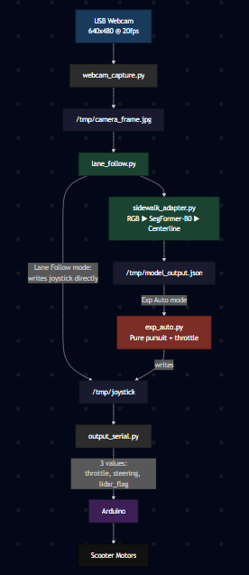

# Scooter

The scooter build of the openpilot fork. It runs on a Jetson Orin NX mounted
on an electric scooter. The default launch uses the SegFormer sidewalk model
through `tools/adapters/sidewalk_adapter.py` and drives autonomously through
`tools/exp_auto.py`. Openpilot's supercombo road model is also present in
`tools/adapters/supercombo_adapter.py` but is not in the default launch path.

The top-level [`../README.md`](../README.md) covers the overall architecture,
IPC layout, and shared setup. This file documents only what is specific to
the scooter.

### Scooter pipeline



---

## Differences from the go-kart

| | Scooter | Go-kart |
|---|---|---|
| Compute | Jetson Orin NX, Ampere GPU | Jetson Xavier NX, Volta GPU |
| Active model | `sidewalk_segmentation.engine` (SegFormer-B0) | `segformer_b3_cityscapes.engine` (SegFormer-B3) |
| Secondary model | `supercombo.engine`, not in default launch | none |
| Input color space | RGB for sidewalk, YUV for the unused supercombo path | RGB |
| Main autonomy loop | `tools/exp_auto.py` | `tools/exp_auto.py` |
| Drives on | Sidewalks | Sidewalks |
| Arduino protocol | 3 value CSV: `throttle, steering, lidar_flag` | 6 value CSV: `steer, brake, arm, throttle, direction, speed_setting` |
| Launch script | `./start_scooter.sh` | `./start_kart.sh` |
| Default speed | `0.45` | `5` |

The `tools/` layout, adapter system, web UI, virtual panda, and the file-based
IPC layer are identical between the two folders. Only the model, the
preprocessing, and the Arduino CSV format differ.

Cereal/msgq is left intact for openpilot's upstream daemons. The new custom
scripts add a file-based IPC layer in `/tmp/` on top of cereal, not as a
replacement.

Openpilot is configured to think it is a comma body robot, not a car. This is
done by `tools/virtual_panda.py`, which fakes the comma body panda over cereal
(`brand=body`, `carFingerprint=COMMA BODY`, safety model `body`). The body
profile lets openpilot accept joystick steering and throttle directly.

---

## Setup

1. Flash JetPack 5.x onto the Orin NX.
2. Clone this folder onto the Jetson as `~/openpilotV3`:
   ```bash
   git clone <repo-url> ~/openpilotV3
   ```
3. Install Python deps:
   ```bash
   pip3 install opencv-python numpy onnxruntime-gpu pyserial flask
   ```
4. Rebuild the SegFormer TRT engine on this board (engines are GPU-arch locked):
   ```bash
   cd ~/openpilotV3/selfdrive/modeld/models
   /usr/src/tensorrt/bin/trtexec --onnx=sidewalk_segmentation.onnx --saveEngine=sidewalk_segmentation.engine --fp16
   ```
   Optional: rebuild the supercombo engine only if planning to switch to
   `supercombo_adapter.py`. Its `.onnx` is not committed because it exceeds
   GitHub's 100 MB limit. Download it from
   [comma.ai openpilot releases](https://github.com/commaai/openpilot/releases)
   and build with the same `trtexec` command.
5. Flash the 3 value Arduino sketch. The sketch is not tracked in this repo.
6. Confirm hardware:
   ```bash
   ls /dev/ttyACM* /dev/ttyUSB*
   ```
   Arduino is normally `/dev/ttyACM0` (or `ACM1` if the GPS steals `ACM0`).

---

## Run

```bash
cd ~/openpilotV3
./start_scooter.sh
```

Flags pass through to `tools/launch_all.sh`:
- `--serial /dev/ttyACM1` if GPS is plugged in first
- `--no-model` runs without the neural net
- `--speed 0.45` base cruise throttle, range 0.0 to 1.0

The start script also contains a lidar safety block with its own flags
(`--no-lidar`, `--lidar-port`). Lidar is out of scope for this README and will
be documented later.

The launcher spawns tmux sessions for `webcam`, `vpanda`, `joystick`,
`bodyteleop`, `serial`, `lanefollow`, `overlay`, `expauto`, `autopilot`.

Open the web UI at **http://\<jetson-ip\>:5000**. Engage arms the system.
Lane Follow starts the model. Exp Auto starts autonomous driving. Press
again to disengage. Kill switch: `tmux kill-server`.

---

## Notes

- The SegFormer sidewalk adapter (`tools/adapters/sidewalk_adapter.py`) reads
  horizontal slices of the segmentation mask to find the sidewalk centerline.
  If the camera mount or angle changes, retune the slice ranges in that file.
- TRT engines are GPU-arch locked. The `.engine` built on this Orin (Ampere)
  cannot be copied to the go-kart Xavier (Volta). Rebuild on each board.
- Camera is a USB webcam at 640x480 @ 20fps. `tools/webcam_capture.py` writes
  it to `/tmp/camera_frame.jpg`.
- The supercombo adapter (`tools/adapters/supercombo_adapter.py`) is not in the
  default launch but is available for road-lane testing. Its YUV preprocessing
  is fragile: the Y channel must be subsampled, not quadrant cropped, and
  inputs must be raw `0..255` cast to float16 without dividing by 255.

---

## Custom code paths

All custom code lives under `scooter/tools/`. On the Jetson the same tree is
at `~/openpilotV3/tools/`.

| File | Purpose |
|---|---|
| `scooter/tools/lane_follow.py` | Main loop. Reads camera, runs the model adapter, writes joystick. |
| `scooter/tools/adapters/base_adapter.py` | Abstract interface every adapter implements. |
| `scooter/tools/adapters/sidewalk_adapter.py` | Active scooter adapter. RGB prep, SegFormer mask, sidewalk centerline steering. |
| `scooter/tools/adapters/supercombo_adapter.py` | Optional supercombo adapter. YUV prep, 6120 float output parsing. Not in the default launch path. |
| `scooter/tools/output_serial.py` | Reads `/tmp/joystick`, sends 3 value CSV (`throttle,steering,lidar_flag`) to the Arduino. |
| `scooter/tools/virtual_panda.py` | Impersonates the comma body panda over cereal so openpilot daemons run with no real panda. |
| `scooter/tools/webcam_capture.py` | Writes `/tmp/camera_frame.jpg` from the USB webcam. |
| `scooter/tools/camera_bridge.py` | Alternative camera input that grabs an MJPEG stream from an ESP32 cam over WiFi. |
| `scooter/tools/exp_auto.py` | Experimental autopilot. Constant throttle when sidewalk is detected and model lane keeping. |
| `scooter/tools/autopilot.py` | Constant throttle when on, used for standalone throttle testing. |
| `scooter/tools/overlay_stream.py` | Draws lane lines and planned path on top of the camera feed for the web UI. |
| `scooter/tools/lane_viz.py` | Offline visualization that runs the model on a video file. |
| `scooter/tools/auto_source.py` | Prints log identifiers from an openpilot log file. |
| `scooter/tools/actuator_logger.py` | Logs every joystick command to a CSV file. Uses cereal. |
| `scooter/tools/diagnose_msg.py` | Prints openpilot cereal messages for debugging. |
| `scooter/tools/video_feed.py` | Plays a video file into `/tmp/camera_frame.jpg` for testing without a real camera. |
| `scooter/tools/StartAllAb.sh` | Older nohup-based launcher, superseded by `launch_all.sh`. |
| `scooter/tools/launch_all.sh` | Tmux launcher invoked by `start_scooter.sh`. |
| `scooter/start_scooter.sh` | Top level launch script. |

Model files in `scooter/selfdrive/modeld/models/`:
- `sidewalk_segmentation.onnx` SegFormer-B0, active model
- `sidewalk_segmentation.engine` TRT engine for the above, rebuild on each Jetson
- `supercombo.onnx` openpilot road model, not in default launch
- `supercombo.engine` TRT engine for the above, rebuild on each Jetson

---

## See also

- [`../docs/MODELS_AND_ADAPTERS.md`](../docs/MODELS_AND_ADAPTERS.md)
- [`../docs/IPC.md`](../docs/IPC.md)
